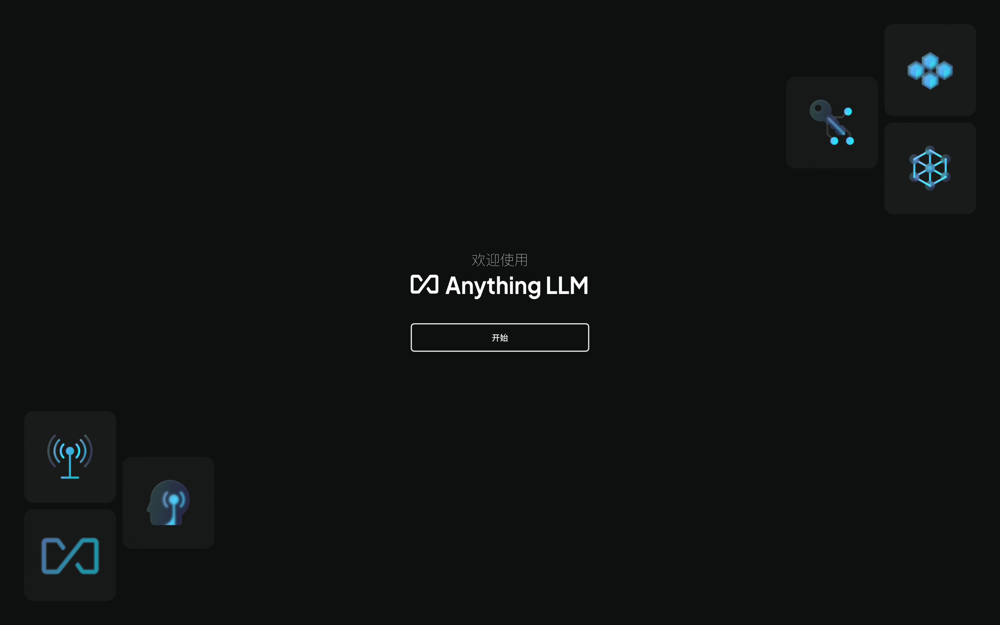
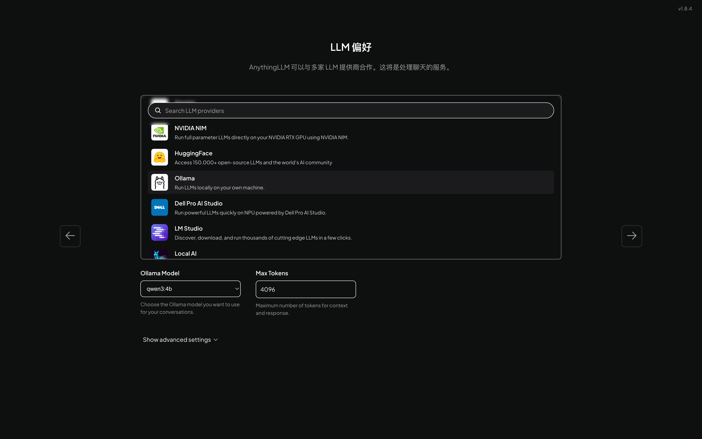
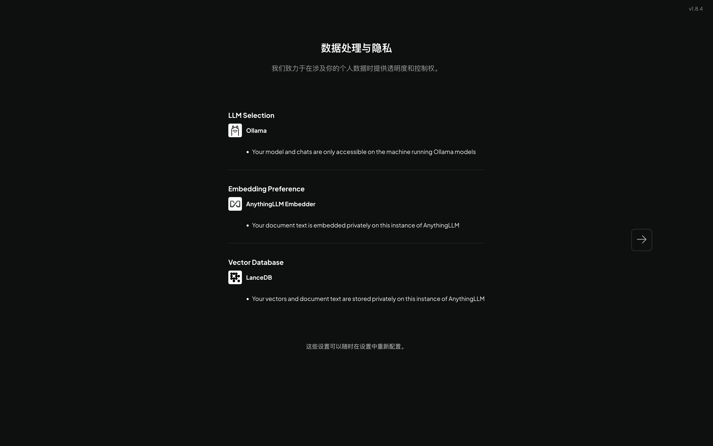
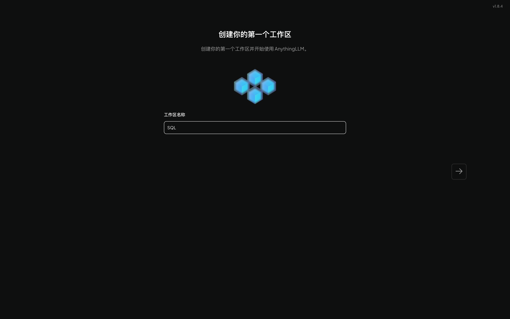
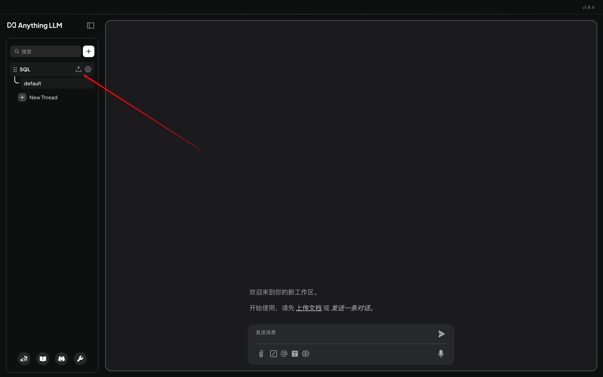
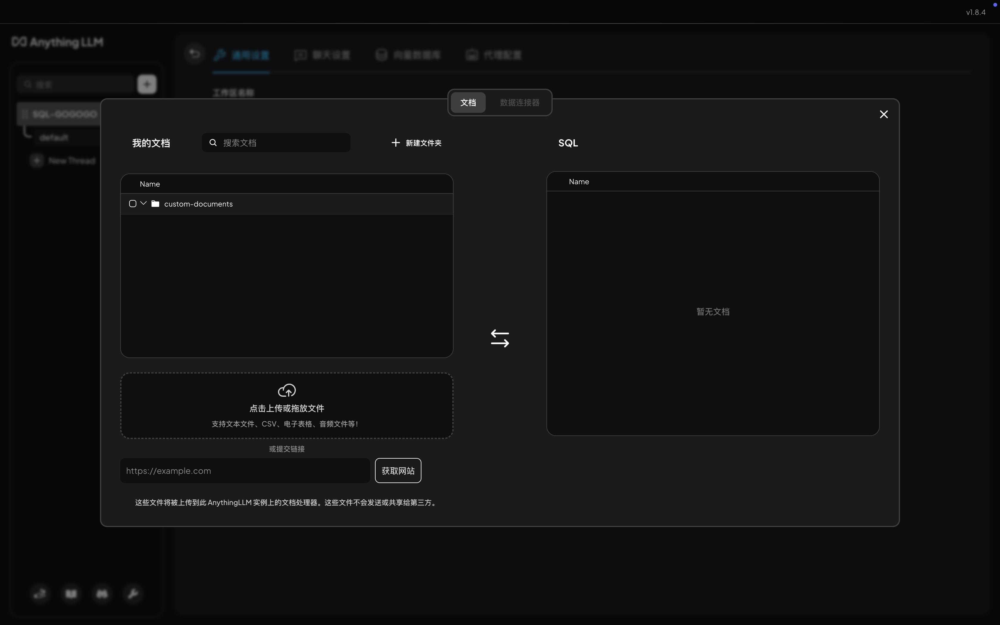
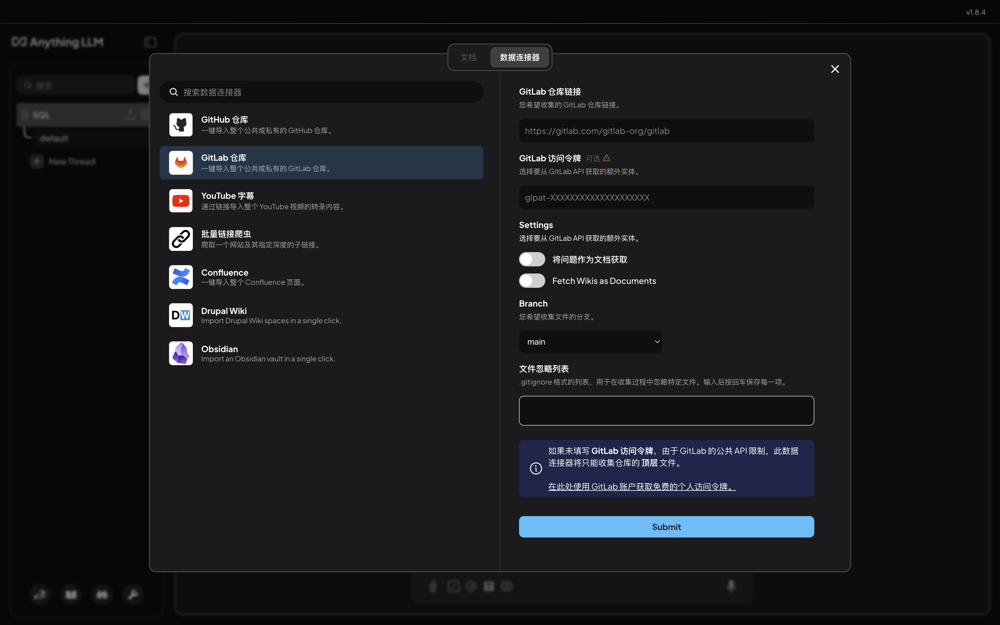
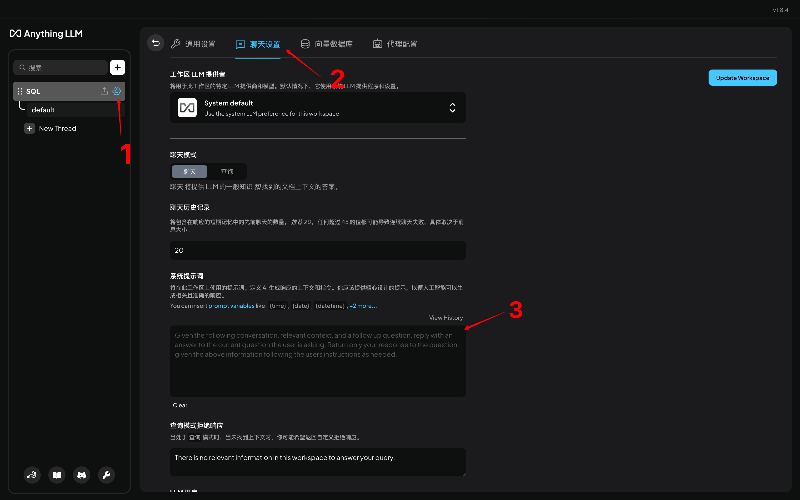

笔者在日常处理提数等需求时，常会遇到逻辑重复开发的问题。为提升开发效率，近期开始将各类需求处理的 SQL 在 GitLab 中创建项目进行存档维护。希望后续开发时便通过本地 IDEA 快速检索、直接复用，提升效率。

在此基础上，笔者有了进一步思考，为何不依托本地 LLM，结合已有 SQL 作为知识库，搭建一套本地 SQL 问答助手。基于此，进一步的实现开发的提效。

基于此，搭建了本地 Ollama + AnythingLLM 来进行一次实践。

**RAG（Retrieval-Augmented Generation）是一种结合检索和生成的技术，通过先从外部知识库中检索相关信息，再由大语言模型生成回答，从而提升准确性和实用性。**

## 一、Ollama

### 1）、相关知识

Ollama 是一款开源跨平台的大模型工具，主要用于在本地便捷部署和运行大型语言模型（LLM）。

- **发展历史：** Ollama 项目始于 2023 年中期，初期支持在 macOS 和 Linux 上通过命令行加载 LLM 模型。随后迅速发展，支持更多主流模型，新增 REST API 与多语言 SDK，并推出了 Windows 实验版本。其 GitHub 社区活跃，星标数破万，成为本地部署 LLM 的代表工具。

- **主要功能：**
- - **广泛模型支持：** 兼容 Llama、Mistral、Gemma、Phi、DeepSeek 等多个主流开源模型，涵盖文本生成、代码开发、翻译等场景。
  - **接口与集成：** 提供 REST API 及 Python、JavaScript SDK，便于集成至各类项目与应用中。
  - **跨平台部署：** 支持 macOS、Linux、Windows（实验版）平台，并可通过 Docker 部署，灵活适配各种运行环境。
  - **高效模型量化：** 采用 GGUF 格式的 4-bit 量化模型，大幅降低资源需求，使消费级设备也能运行高参数模型。
  - **模型定制能力：** 通过 Modelfile 文件，用户可灵活配置温度、上下文长度、系统提示等参数，自定义模型行为。

- **优势特点：**
- - **部署简单：** 只需一行命令即可启动模型（如 ollama run llama2），自动完成模型下载与运行，极大降低部署门槛。
  - **隐私保护：** 所有模型推理过程完全在本地完成，无需将数据发送至云端，满足对数据敏感度高的业务需求。
  - **社区活跃：** Ollama 拥有活跃的开发者社区，持续推出中文微调版、医疗领域模型等多样化模型，并集成了如 Chatbox、Open WebUI 等交互工具，提升使用体验。

### 2）、安装及使用

**安装：** https://ollama.com/download

**可用模型清单：** https://ollama.com/search

### 3）、常用操作命令

| 分类           | 操作                   | 命令示例                                                     | 说明                                         |
| -------------- | ---------------------- | ------------------------------------------------------------ | -------------------------------------------- |
| 🟢 模型管理     | 启动 ollama 服务       | `ollama serve`                                               |                                              |
|                | 创建自定义模型         | `ollama create my-model -f ./Modelfile`                      | 通过 Modelfile 构建个性化模型                |
|                | 查看模型信息           | `ollama show qwen3:8b`                                       | 查看模型构建与配置详情                       |
|                | 启动模型并进入交互模式 | `ollama run qwen3:8b`                                        |                                              |
|                | 停止运行中的模型       | `ollama stop qwen3:8b`                                       |                                              |
|                | 下载指定模型           | `ollama pull qwen3:8b`                                       |                                              |
|                | 推送指定的模型到仓库   | `ollama pull my-model`                                       | 推送到仓库的模型会在ollama官网个人仓库中出现 |
|                | 显示已安装模型列表     | `ollama list`                                                |                                              |
|                | 列出正在运行的模型     | `ollama ps`                                                  |                                              |
|                | 模型拷贝               | `ollama cp qwen3:4b qwen3:888b`                              |                                              |
|                | 删除本地模型           | `ollama rm qwen3:888b`                                       |                                              |
| 🌐 API 调用     | 文本生成接口调用       | `curl http://localhost:11434/api/generate -d '{"model": "llama2", "prompt": "你好"}'` | 使用本地 REST API 生成文本                   |
| **📎** **其他** | 查看版本               | `ollama --version`                                           | 查看当前 Ollama 版本                         |
|                | 查看帮助               | `ollama help`                                                | 获取全部命令帮助信息                         |

类似功能的竞品有：APT4All、LM Studio等。

## 二、AnythingLLM

### 1）相关知识

- AnythingLLM 是一个全栈应用，支持本地或远程部署，结合主流商业或开源大语言模型与向量数据库，帮助用户构建私有化的智能问答系统。它通过 工作区（Workspaces） 管理文档，每个工作区独立隔离，支持上下文对话且不会互相干扰，便于多任务处理与知识组织。

- 向量数据库（Vector Database） 是一种专门用于存储、管理和检索高维向量数据的数据库，常用于实现 相似度搜索，特别适合与 大语言模型（LLM） 配合，支持 RAG 等技术场景。

### 2）安装

**官网地址：** https://anythingllm.com/

### 3）结合 Ollama 搭建并使用本地 RAG 知识库

1. 基于官网下载安装

2. LLM 偏好选择 Ollama，并选择具体模型

3. 数据处理与隐私：默认使用 AnythingLLM 的本机嵌入引擎，向量数据库默认选中 LanceDB，后续在设置中可以更改。

4. 创建工作区，并在工作区中导入相应数据即可使用。

5. 添加知识可选择本地文本文件或通过GitHub、GitLab、Confluence等连接器导入远程数据。

6. 添加完知识库后便可正常对话使用了，具体领域的对话效果取决于使用的 LLM 及知识库数据丰富程度，为了更好的对话效果可以在工作区的设置中配置具体的提示词。

